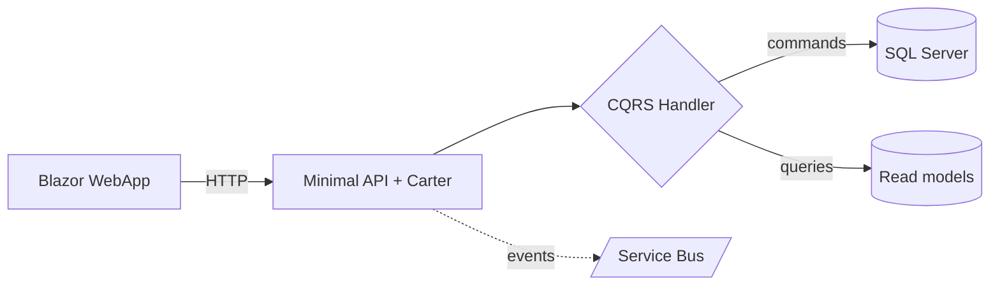

Somewhere in your wiki sleeps a magnificent architecture diagram. Three hours of Visio, impeccable arrows, colors by domain. It has a single flaw: it describes the system of **two years ago**. Nobody updated it, because updating a PNG requires finding the source file, the tool, and the courage.

After [ADRs]({{ site.baseurl }}/2026/07/14/adr-memory-of-architecture-decisions/) and [yesterday's glossary]({{ site.baseurl }}/2026/07/16/the-domain-glossary/), here's the third piece of a repository that talks: **diagrams as code**. The idea fits in one sentence — a diagram written as *text*, versioned with the code, rendered on the fly. And in the agent era, it changes everything: an image, the AI looks at; text, it **reads and updates**. You'll see: it's not rocket science.

<!--more-->

## The problem: the map and the territory

An architecture diagram is a **map**. And a wrong map is worse than no map: it gives you confidence in the wrong direction. All image-diagrams end up wrong, for a mechanical reason: the update cost is disproportionate. Changing the code takes two minutes; reopening Visio, finding the `.vsdx`, redrawing, re-exporting, re-uploading to the wiki takes twenty. Guess which step gets skipped.

Diagrams as code break that mechanism: the "source" of the drawing is a block of text **in the repository**, next to the code it describes. Updating it is a three-line edit, reviewed in a pull request like everything else.

## Mermaid: the standard that renders itself

[Mermaid](https://mermaid.js.org/) has become the default choice, for one decisive reason: **GitHub, GitLab, Azure DevOps and VS Code render it natively**. A code block in any Markdown, and the drawing appears:

````markdown

````

That block lives in your `README.md`, in an ADR, in `docs/architecture.md` — and it renders drawn wherever the file is read. No tool to install, no export, no attachment.

Mermaid covers the everyday essentials:

| Type | For drawing what |
| --- | --- |
| `flowchart` | flows, dependencies between components |
| `sequenceDiagram` | who calls whom, in what order — perfect for an API |
| `erDiagram` | the data model and its relationships |
| `stateDiagram` | an entity's statuses (order, policy, claim…) |
| `C4Context` / `C4Container` | high-level [C4](https://c4model.com/) views |

For the big picture, the **C4 model** is worth the detour: four zoom levels (context, containers, components, code), of which the first two cover 90% of projects. A C4 context diagram in Mermaid in the README, and any newcomer — human or agent — knows in thirty seconds who talks to whom.

## Why it's worth double in the AI-agent era

Back to the opening distinction, because it carries the whole article:

- **A PNG is opaque.** The agent can at best "look" at it with vision and extract an approximate description — and it will never be able to modify it.
- **A Mermaid block is data.** The agent reads it like code: every node, every arrow, every label. And above all, it can **edit** it — the diagram joins the work loop instead of being decoration.

Concretely, three uses that change the daily routine:

1. **Instant re-contextualization.** "Read `docs/architecture.md` before starting": the diagrams give the agent the system's topology in a few hundred tokens — infinitely denser than an explanation in prose.
2. **Generation on demand.** "Draw the sequence diagram for this endpoint": the agent reads the code and produces the Mermaid in thirty seconds. The diagram that didn't exist becomes free — and will seed the discussion in review.
3. **Updates in the same PR.** The instruction that changes everything, to carve into your [agent instructions]({{ site.baseurl }}/2026/07/02/github-copilot-skills-instructions-agents-mcp/): *"if your change modifies a flow described in docs/, update the diagram in the same PR"*. The map and the territory move together — the reviewer sees the code *and* the map change in the same diff.

## When a diagram deserves to exist

Same selectivity logic as ADRs and the glossary — the value comes from what you **refuse** to draw:

- ✅ The **context view** (who talks to whom): one per system, always.
- ✅ The **non-obvious sequences**: authentication, payment saga, retry — the things you re-explain at every onboarding.
- ✅ The **stateful lifecycles**: an order's statuses and their legal transitions.
- ❌ The exhaustive class diagram: the code already says it, better.
- ❌ The 200-box wall poster: unreadable on screen, wrong within a month. **Ten small, focused diagrams beat one fresco.**

## The honest word

- **Mermaid is not Visio.** Layout is automatic and sometimes stubborn: you don't always get *exactly* the arrangement you dreamed of, and very large graphs turn to spaghetti. That's the price of the three-line update — and a healthy incentive to keep things small.
- **Rendering varies by tool.** GitHub limits some newer types (C4 diagrams notably); test where your team actually *reads* the docs.
- **A diagram as code can lie too.** It doesn't go stale on its own, but it goes stale. The difference: the update costs three lines in the PR that changes the code — no more excuses.

## In summary

- Image-diagrams all end up **wrong**, because updating them costs twenty times more than updating the code. Diagrams as code (Mermaid, C4) put the map back **in the repository**, versioned and reviewed in PRs.
- GitHub, GitLab and VS Code **render Mermaid natively**: one Markdown code block, zero tools, zero exports.
- To an AI, an image is opaque; Mermaid is **data**: the agent reads it to re-contextualize, generates it from the code, and **updates it in the same PR** as the change.
- Selectivity as always: context, tricky sequences, state lifecycles — **ten small diagrams beat a wall fresco**.

Next time someone asks "got a schema for this?", the answer fits in a text block next to the code — and your agent will maintain it with you. And that, honestly… it's not rocket science.
