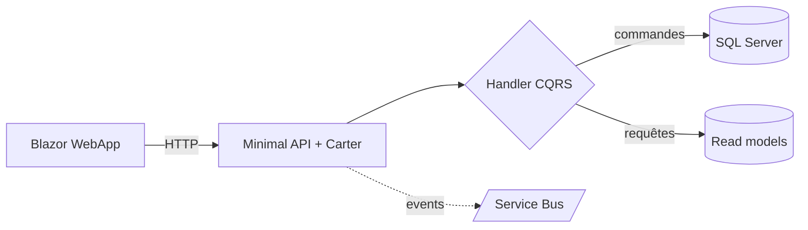

Quelque part dans votre wiki dort un magnifique diagramme d'architecture. Trois heures de Visio, des flèches impeccables, des couleurs par domaine. Il a un seul défaut : il décrit le système d'**il y a deux ans**. Personne ne l'a mis à jour, parce que mettre à jour un PNG demande de retrouver le fichier source, l'outil, et le courage.

Après [les ADR]({{ site.baseurl }}/fr/2026/07/14/adr-memoire-decisions-architecture/) et [le glossaire d'hier]({{ site.baseurl }}/fr/2026/07/16/le-glossaire-du-domaine/), troisième pièce du dépôt qui parle : les **diagrammes as code**. L'idée tient en une phrase — un diagramme écrit en *texte*, versionné avec le code, rendu à la volée. Et à l'ère des agents, elle change tout : une image, l'IA la regarde ; du texte, elle le **lit et le met à jour**. Vous allez voir : c'est pas sorcier.

<!--more-->

## Le problème : la carte et le territoire

Un diagramme d'architecture est une **carte**. Or une carte fausse est pire que pas de carte : elle donne confiance dans une direction erronée. Et tous les diagrammes-images finissent faux, pour une raison mécanique : le coût de mise à jour est disproportionné. Modifier le code prend deux minutes ; rouvrir Visio, retrouver le `.vsdx`, redessiner, réexporter, re-uploader dans le wiki en prend vingt. Devinez ce qu'on saute.

Le diagramme as code casse cette mécanique : la « source » du dessin est un bloc de texte **dans le dépôt**, à côté du code qu'il décrit. Le mettre à jour est une édition de trois lignes, relue en pull request comme le reste.

## Mermaid : le standard qui s'affiche tout seul

[Mermaid](https://mermaid.js.org/) est devenu le choix par défaut, pour une raison décisive : **GitHub, GitLab, Azure DevOps et VS Code le rendent nativement**. Un bloc de code dans n'importe quel Markdown, et le dessin apparaît :

````markdown

````

Ce bloc vit dans votre `README.md`, dans un ADR, dans `docs/architecture.md` — et il s'affiche dessiné partout où on lit le fichier. Pas d'outil à installer, pas d'export, pas de pièce jointe.

Mermaid couvre l'essentiel du quotidien :

| Type | Pour dessiner quoi |
| --- | --- |
| `flowchart` | flux, dépendances entre composants |
| `sequenceDiagram` | qui appelle qui, dans quel ordre — parfait pour une API |
| `erDiagram` | le modèle de données et ses relations |
| `stateDiagram` | les statuts d'une entité (commande, contrat, sinistre…) |
| `C4Context` / `C4Container` | les vues [C4](https://c4model.com/) de haut niveau |

Pour la vision d'ensemble, le modèle **C4** mérite le détour : quatre niveaux de zoom (contexte, conteneurs, composants, code), dont les deux premiers suffisent à 90 % des projets. Un diagramme de contexte C4 en Mermaid dans le README, et tout nouveau venu — humain ou agent — sait en trente secondes qui parle à qui.

## Pourquoi ça vaut double à l'ère des agents IA

Reprenons la distinction du début, parce qu'elle porte tout l'article :

- **Un PNG est opaque.** L'agent peut à la rigueur le « regarder » avec de la vision, en tirer une description approximative — et il ne pourra jamais le modifier.
- **Un bloc Mermaid est de la donnée.** L'agent le lit comme du code : chaque nœud, chaque flèche, chaque libellé. Et surtout, il peut l'**éditer** — le diagramme entre dans la boucle de travail au lieu d'être une décoration.

Concrètement, trois usages qui changent le quotidien :

1. **Re-contextualisation éclair.** « Lis `docs/architecture.md` avant de commencer » : les diagrammes donnent à l'agent la topologie du système en quelques centaines de tokens — infiniment plus dense qu'une explication en prose.
2. **Génération à la demande.** « Dessine le diagramme de séquence de ce endpoint » : l'agent lit le code et produit le Mermaid en trente secondes. Le diagramme qui n'existait pas devient gratuit — et servira de base de discussion en revue.
3. **Mise à jour dans la même PR.** La consigne qui change tout, à graver dans vos [instructions d'agent]({{ site.baseurl }}/fr/2026/07/02/github-copilot-skills-instructions-agents-mcp/) : *« si ta modification change un flux décrit dans docs/, mets à jour le diagramme dans la même PR »*. La carte et le territoire bougent ensemble — le reviewer voit le code *et* la carte changer dans le même diff.

## Quand un diagramme mérite d'exister

Même logique de sélectivité que pour les ADR et le glossaire — la valeur vient de ce qu'on **refuse** de dessiner :

- ✅ La **vue de contexte** (qui parle à qui) : une par système, toujours.
- ✅ Les **séquences non évidentes** : authentification, saga de paiement, retry — ce qu'on réexplique à chaque onboarding.
- ✅ Les **cycles de vie à états** : les statuts d'une commande et leurs transitions légales.
- ❌ Le diagramme de classes exhaustif : le code le dit déjà, et mieux.
- ❌ Le poster mural de 200 boîtes : illisible à l'écran, faux dans un mois. **Dix petits diagrammes ciblés battent une fresque.**

## Le mot d'honnêteté

- **Mermaid n'est pas Visio.** Le placement est automatique et parfois têtu : on n'obtient pas toujours *exactement* la disposition rêvée, et les très gros graphes deviennent spaghetti. C'est le prix de la mise à jour à trois lignes — et une incitation saine à faire petit.
- **Le rendu varie selon l'outil.** GitHub limite certains types récents (les diagrammes C4 notamment) ; testez où votre équipe *lit* réellement les docs.
- **Un diagramme as code peut mentir aussi.** Il ne se périme pas tout seul, mais il se périme. La différence : la mise à jour coûte trois lignes dans la PR qui change le code — plus d'excuse.

## En résumé

- Les diagrammes-images finissent tous **faux**, parce que leur mise à jour coûte vingt fois plus cher que celle du code. Le diagramme as code (Mermaid, C4) remet la carte **dans le dépôt**, versionnée et relue en PR.
- GitHub, GitLab et VS Code **rendent Mermaid nativement** : un bloc de code Markdown, zéro outil, zéro export.
- Pour l'IA, une image est opaque ; du Mermaid est de la **donnée** : l'agent le lit pour se re-contextualiser, le génère depuis le code, et le **met à jour dans la même PR** que le changement.
- Sélectivité toujours : contexte, séquences piégeuses, cycles d'états — **dix petits diagrammes battent une fresque murale**.

La prochaine fois qu'on vous demande « t'aurais pas un schéma ? », la réponse tient dans un bloc de texte à côté du code — et votre agent la maintiendra avec vous. Et ça, franchement… c'est pas sorcier.
